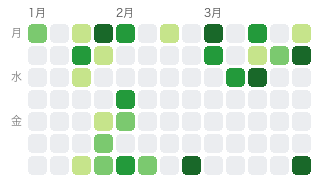

<p align="center">
  
</p>

<h1 align="center">DailyClaw</h1>

<p align="center">
  <strong>An extendable personal life assistant that lives in your Telegram.</strong><br>
  <em>Record anything. Reflect every night. Track habits. Extend with plugins.</em>
</p>

<p align="center">
  <a href="#features">Features</a> &bull;
  <a href="#quick-start">Quick Start</a> &bull;
  <a href="#commands">Commands</a> &bull;
  <a href="#configuration">Configuration</a> &bull;
  <a href="#i18n">Languages</a> &bull;
  <a href="#architecture">Architecture</a> &bull;
  <a href="#license">License</a>
</p>

<p align="center">
  
  
  
  
</p>

---

## Why DailyClaw?

I'm an INTJ software engineer at a major tech company. I have a lot of ideas, read constantly, and believe in daily self-reflection as a path to improvement. I wanted a private assistant that helps me manage my daily life -- record thoughts, track habits, reflect every night, summarize my week.

I looked at projects like [OpenClaw](https://github.com/openclaw/openclaw) but they're built for enterprise workflows -- multi-channel orchestration, complex agent pipelines, dozens of integrations. I needed something for **personal life, not work**.

So I built DailyClaw for people like me -- and maybe like you:

- You want to **record thoughts, links, photos, voice notes** throughout the day without friction
- You want a **nightly reflection ritual** guided by your bot, not an empty journal page
- You want to **track habits** and see your consistency on a heatmap
- You want to **extend it** with your own plugins (book tracker, expense logger, fitness diary...)
- You want it **private** (self-hosted, your data stays with you) and **simple** (one config file, one Docker command)

**DailyClaw is not an enterprise agent framework. It's a personal life assistant that lives in your pocket -- and grows with you through plugins.**

---

## Features

### Recording -- just send it
Send text, photos, voice, or video to your bot. DailyClaw auto-classifies, deduplicates, and stores everything.

- **Smart classification** -- LLM categorizes messages (morning routine, reading, social, reflection, idea)
- **URL summarization** -- share a link, get a 2-sentence summary
- **Image understanding** -- vision model describes your photos
- **Semantic dedup** -- won't save the same thought twice
- **Photo dedup** -- SHA-256 content hash prevents duplicate images

### Reflection -- Zeng Guofan's four daily questions
Start `/journal_start` and your bot guides you through four categories:

1. **Morning** -- How did you start the day?
2. **Reading** -- What did you read or learn?
3. **Social** -- How did you interact with others?
4. **Reflection** -- What needs improvement?

Skip any category with "skip". Cancel anytime with `/journal_cancel`.

### Auto-Journal -- never miss a day
At **23:50 every night**, if you haven't written a journal but have sent messages, DailyClaw automatically generates a journal entry from your day's recordings using LLM. You'll get a notification before and after.

### Planning & Habits
Create plans with natural language, check in with free-form descriptions, track weekly progress with emoji bars.

```
/planner_add Study IELTS daily, remind at 8pm
/planner_checkin Practiced listening for 30 min today
/planner_list
```

### Heatmap -- see your consistency
`/recorder_list` generates a GitHub-style contribution heatmap (last 90 days) showing your recording frequency:

<p align="center">
  
  
  
</p>

### Sharing & Export
- `/sharing_summary week` -- LLM-generated weekly summary
- `/sharing_export 2026-04-05` -- full daily export (messages + journal)

### Multi-language (i18n)
Switch with `/lang`:
- **English** (default), **Chinese**, **Japanese**
- All UI, LLM prompts, and heatmap labels adapt to your language

---

## Quick Start

### Prerequisites
- A Telegram bot token (talk to [@BotFather](https://t.me/BotFather))
- An LLM API key (OpenAI-compatible: OpenAI, DeepSeek, Doubao, etc.)

### Docker Hub (easiest)

```bash
mkdir dailyclaw && cd dailyclaw

# Create your config
curl -O https://raw.githubusercontent.com/buhuipao/dailyclaw/main/config.example.yaml
cp config.example.yaml config.yaml
# Edit config.yaml with your tokens

# Create .env
cat > .env << 'EOF'
TELEGRAM_BOT_TOKEN=your-token-here
LLM_API_KEY=sk-xxx
EOF

# Run
docker run -d --name dailyclaw \
  --env-file .env \
  -v $(pwd)/config.yaml:/app/config.yaml:ro \
  -v $(pwd)/data:/app/data \
  buhuipao/dailyclaw:latest
```

### Docker Compose

```bash
git clone https://github.com/buhuipao/dailyclaw.git
cd dailyclaw
cp config.example.yaml config.yaml
# Edit config.yaml with your tokens
docker compose up -d
```

### Local Python

```bash
git clone https://github.com/buhuipao/dailyclaw.git
cd dailyclaw
python -m venv .venv && source .venv/bin/activate
pip install -e .
cp config.example.yaml config.yaml
# Edit config.yaml with your tokens
python -m src.main
```

---

## Commands

| Command | Description |
|---------|-------------|
| `/start` | Welcome message |
| `/help` or `/h` | Show all commands |
| `/lang <zh\|en\|ja>` | Switch language |
| **Recording** | |
| `/recorder_today` | View today's records |
| `/recorder_list` | Recording heatmap (90 days) |
| `/recorder_del <id>` | Delete a record |
| **Journal** | |
| `/journal_start` | Start daily reflection |
| `/journal_today` | View today's journal |
| `/journal_cancel` | Cancel current session |
| **Planner** | |
| `/planner_add <desc>` | Create a plan |
| `/planner_checkin <desc>` | Check in (smart match) |
| `/planner_list` | View plan progress |
| `/planner_del <name>` | Archive a plan |
| **Sharing** | |
| `/sharing_summary [week\|month]` | Generate summary |
| `/sharing_export [YYYY-MM-DD]` | Export daily content |
| **Admin** | |
| `/invite <user_id>` | Invite a user |
| `/kick <user_id>` | Remove a user |

---

## Configuration

All settings live in `config.yaml`:

```yaml
log_level: "INFO"              # DEBUG for development

timezone: "Asia/Shanghai"

telegram:
  token: "${TELEGRAM_BOT_TOKEN}"
  allowed_user_ids:
    - 123456789                # Your Telegram user ID

llm:
  text:
    base_url: "https://api.openai.com/v1"
    api_key: "${LLM_API_KEY}"
    model: "gpt-4o-mini"
  vision:                      # Optional
    base_url: "https://api.openai.com/v1"
    api_key: "${VISION_API_KEY}"
    model: "gpt-4o"

plugins:
  recorder: {}
  journal:
    remind_hour: 21
    remind_minute: 0
  planner: {}
  sharing:
    output_dir: "./data/site"
```

Environment variables are resolved via `${VAR}` syntax. Put secrets in `.env`:

```
TELEGRAM_BOT_TOKEN=your-token-here
LLM_API_KEY=sk-xxx
VISION_API_KEY=sk-xxx
```

---

## Architecture

```
src/
  core/              # Framework: DB, LLM, i18n, retry, plugin system
    i18n/            # Translation registry (zh/en/ja)
    bot.py           # Event, Command, BotAdapter ABCs
    db.py            # SQLite + migration runner
    llm.py           # Multi-modal LLM service (text/vision)
    retry.py         # @with_retry decorator (exponential/fixed/jitter)
    plugin.py        # Auto-discovery plugin system
  adapters/
    telegram.py      # Telegram adapter with ACK-first dispatch
  plugins/
    recorder/        # Message recording, classification, dedup, URL summary
    journal/         # Zeng Guofan reflection + auto-journal generation
    planner/         # Goal tracking, smart check-in, reminders
    sharing/         # Weekly/monthly summaries, daily export
```

**Design principles:**
- **Plugin-based** -- each feature is a self-contained plugin with its own DB migrations, commands, and locale
- **ACK-first** -- every message gets an immediate acknowledgment, then processes in the background
- **Retry-resilient** -- all external calls (Telegram API, LLM, HTTP) use `@with_retry` with configurable backoff
- **Immutable data** -- frozen dataclasses, no mutation, functional style
- **Private by default** -- self-hosted, SQLite, no telemetry, no cloud dependency

---

## i18n

DailyClaw supports English, Chinese, and Japanese. Switch anytime:

```
/lang en    English (default)
/lang zh    Chinese
/lang ja    Japanese
```

Everything adapts: UI messages, LLM prompts, heatmap labels, journal reflection, summaries.

---

## Contributing

Contributions are welcome -- especially **new plugins**!

DailyClaw is designed to be extended. Want a fitness tracker, a mood logger, a book list, an expense tracker? Build it as a plugin.

### Creating a Plugin

See the full guide: **[docs/creating-plugins.md](docs/creating-plugins.md)**

TL;DR -- a plugin is a folder under `src/plugins/` with:
- `__init__.py` -- plugin class inheriting `BasePlugin`
- `commands.py` -- command handlers
- `locale.py` -- translations (zh/en/ja)
- `migrations/` -- SQL schema files

The framework auto-discovers your plugin, runs migrations, and registers commands. No wiring needed.

### General Contributions

1. Fork the repo
2. Create a feature branch
3. Write tests (TDD preferred, 80%+ coverage)
4. Submit a PR

```bash
# Run tests
pip install -e ".[dev]"
pytest tests/ -v

# Run a specific test
pytest tests/test_plugins/test_your_plugin.py -v
```

---

## License

[MIT](LICENSE) -- use it however you want.

---

<p align="center">
  <strong>DailyClaw</strong> -- built by someone who just wanted a better way to journal.<br>
  If you find it useful, a star would mean a lot.
</p>
